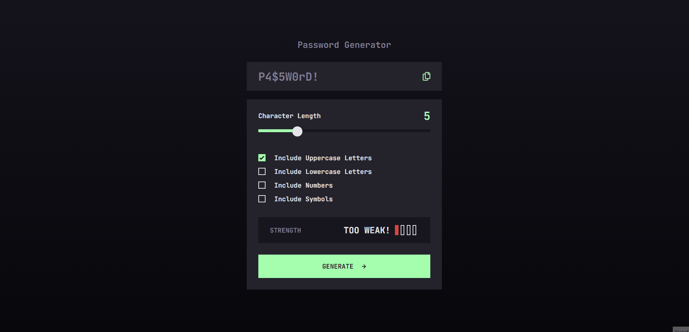

<h1 align="center">
  <span>Password Generator</span>
</h1>

<p align="center">
  <a href="#-project">Project</a>&nbsp;&nbsp;&nbsp;|&nbsp;&nbsp;&nbsp;
  <a href="#-technologies">Technologies</a>&nbsp;&nbsp;&nbsp;|&nbsp;&nbsp;&nbsp;
  <a href="#-setup">Setup</a>&nbsp;&nbsp;&nbsp;|&nbsp;&nbsp;&nbsp;
  <a href="#-license">License</a>
</p>
<br>

<p align="center">
  
</p>

<br>

## 🚀 Project

Your challenge is to build out this password generator app and get it looking as close to the design as possible.

You can use any tools you like to help you complete the challenge. So if you've got something you'd like to practice, feel free to give it a go.

Your users should be able to:

- Generate a password based on the selected inclusion options
- Copy the generated password to the computer's clipboard
- See a strength rating for their generated password
- View the optimal layout for the interface depending on their device's screen size
- See hover and focus states for all interactive elements on the page

## 💻 Technologies

This project was developed using the following technologies:

-   [TypeScript](https://www.typescriptlang.org/)
-   [React](https://pt-br.reactjs.org/)
-   [Styled Components](https://styled-components.com/)
-   [Vite](https://vitejs.dev/)
-   [Vercel](https://vercel.com/)

## 📥 Setup

Clone this repository and navigate to the directory. Then, install all dependencies with the following command:

```bash
npm i
```
Next, run the command:

```bash
npm run dev
```

## 📝 License

This project is licensed under the MIT license. See the [LICENSE](LICENSE.md) file for more details.

---

**Developed by [Bruno César](https://github.com/brunocs90).**

